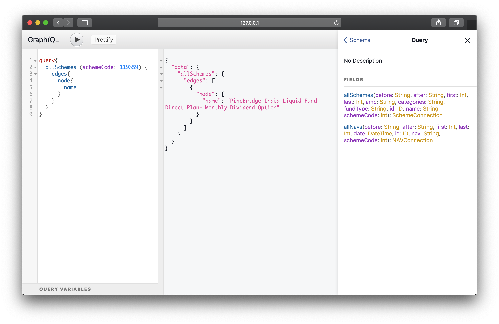

# Amfibious - Mutual Funds for Everyone

Amfibious aims to make Indian Mutual Funds data accessible to everyone.

## How?

`$ python setup.py install`

`$ python3 app.py`

That's it!
You should see data from `START_DATE` (defined in `amfibious/config.py`) to today in `amfibious` MongoDB Collection.

Amfibious also includes a handy GraphQL API.

To launch the same:

`$ python3 api/app.py`

This should start a GraphiQL interface on port 3000 allowing you to query Schemes and NAVs.

## Data

Need data without hassle of running scripts above?
[Download this dataset containing NAVs since 1 Jan 2000 to 31 Jan 2019.](https://yadi.sk/d/rq9drcPOp757Tg)

## Licence

MIT
